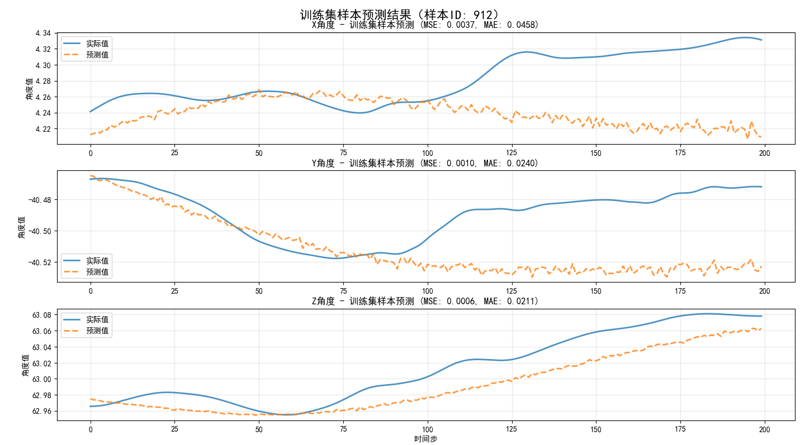
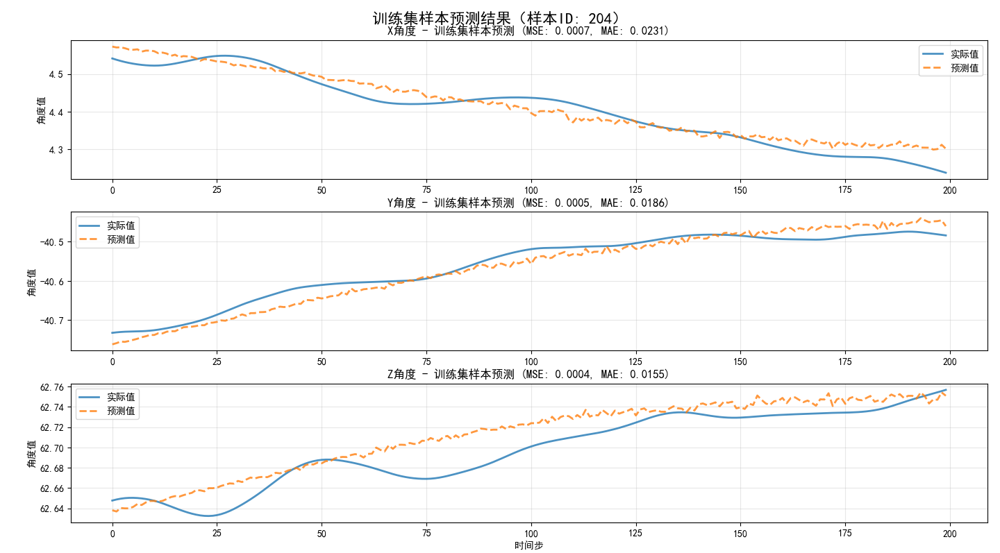
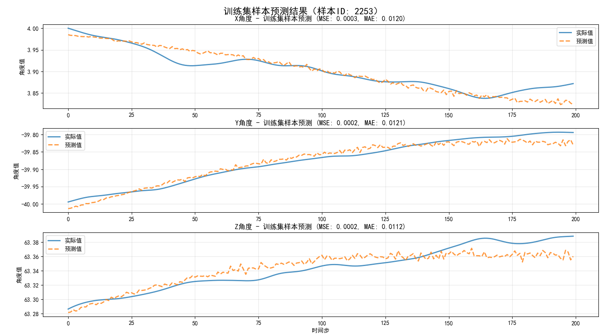
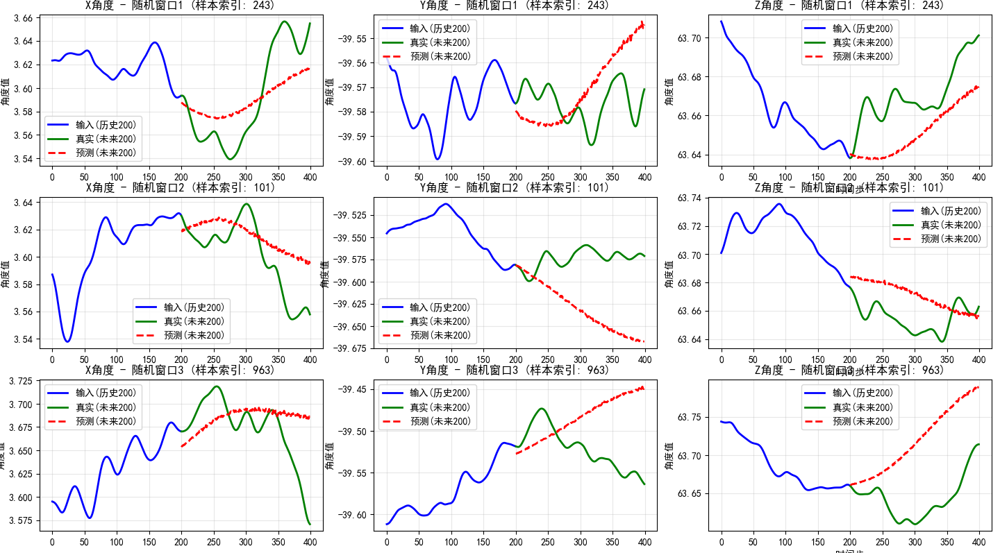
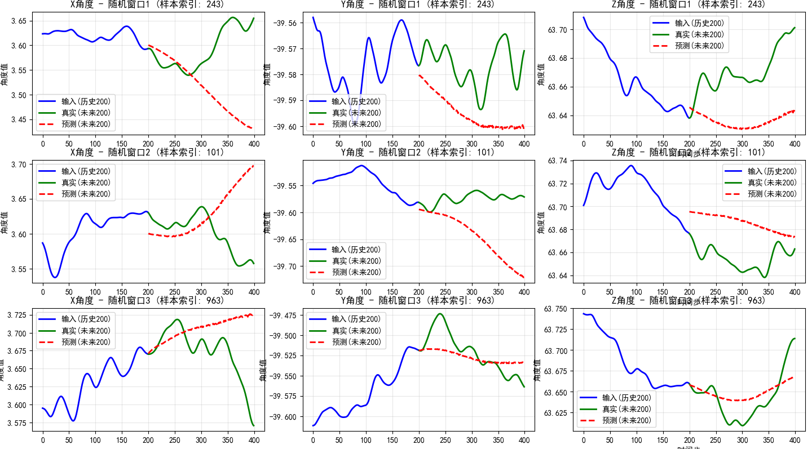
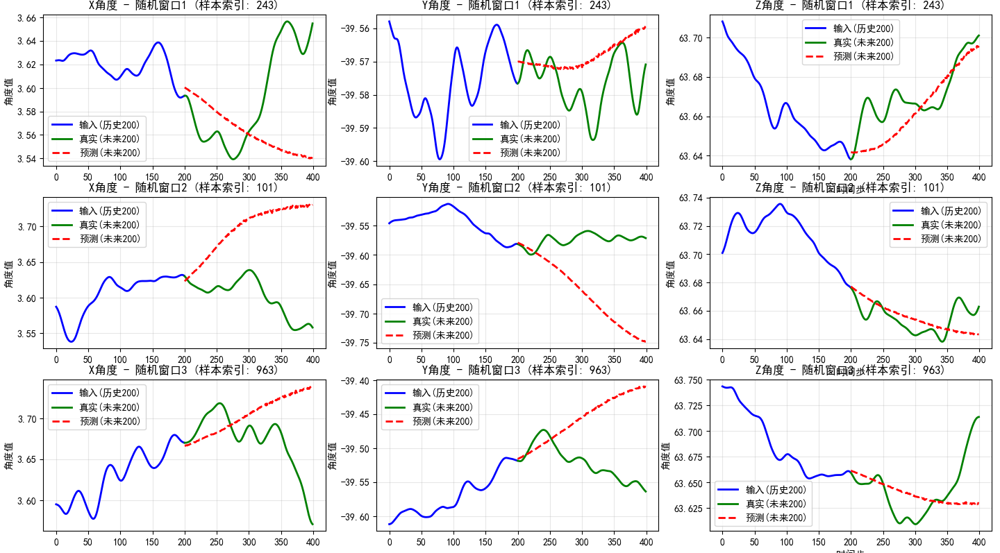

# 手机摄像头抖动预测算法
孙嘉艺   23371095   
2025.9.21
## 一、数据处理
在文件夹 `data_preprocessing` 中，尝试对 `data.csv` 文件中 6000 至 12000 行的样本数据进行探索分析，旨在揭示 x角度、y角度、z角度之间的关系，为后续的模型构建，特别是物理约束的引入，提供了理论支持。

包括以下三个脚本文件：

### 1. `xyz.py`：变量间相关性分析

*   **目标**：初步探究三个角度变量之间的**线性相关程度**。
*   **方法**：通过计算变量两两之间的皮尔逊相关系数，并利用热力图进行可视化，直观地展示它们的相关性强度和方向。
*   **结论**：此分析帮助我们快速理解了各轴向角度变化是否存在简单的线性关联，是理解多变量数据关系的第一步。

### 2. `xz_y.py`：物理关系建模与方程提取

*   **目标**：量化 `x_angle_1` 和 `z_angle_1` 对 `y_angle_1` 的共同影响，并构建一个数学模型来描述此关系。
*   **方法**：采用多元线性回归分析，以 `x` 和 `z` 角度为自变量，`y` 角度为因变量，拟合出一个线性方程。
*   **结论**：成功提取出回归方程：`y_angle_1 = 0.3432 * x_angle_1 + 1.3663 * z_angle_1 - 127.8877`。这个方程揭示了变量间存在的简化物理规律，并被直接应用于后续 `PatchTST` 模型的损失函数中，作为**物理约束项**，提升模型预测结果的物理合理性。

### 3. `pca.py`：主成分分析（PCA）

*   **目标**：对三维角度数据进行降维，识别出数据变化最主要的方向，即**主成分**，从而理解手机运动的核心模式。
*   **方法**：应用主成分分析（PCA），计算各主成分的方差贡献率，并确定主成分的方向。
*   **结论**：通过分析方差贡献率，我们能够判断手机的运动（如抖动）在多大程度上是沿着某个特定方向或平面发生的。
## 二、patchtst预测

本项目中，PatchTST 模型的训练、评估和超参数寻优围绕以下几个核心文件展开：

```
program/
│
├── 📄 train_patchtst.py
│   └── 作用：核心训练脚本。负责数据加载、预处理、构建滑动窗口、配置模型、定义训练参数和损失函数，并执行完整的模型微调流程。
│
├── 📄 predict_patchtst.py
│   └── 作用：模型推理脚本。加载已保存的最佳模型（`best_patchtst_model`）和标准化器（`scalers.pkl`），对测试集进行预测，计算评估指标，并可视化预测结果。
│
├── 🧪 choose_patchsize.py
│   └── 作用：超参数实验脚本。通过遍历不同的 `patch_length` 值（如 8, 16, 32, 64），系统性地评估其对模型性能的影响，以找出最优的 Patch Size。
│
├── 🧪 choose_optimizer_lr.py
│   └── 作用：超参数实验脚本。对不同的优化器（如 AdamW, SGD）和学习率组合进行网格搜索，旨在找到收敛最快、效果最好的优化策略。
│
├── 🧪 choose_regularization.py
│   └── 作用：超参数实验脚本。用于测试不同正则化参数（如 dropout, weight_decay）组合对抑制过拟合的效果，以提升模型的泛化能力。
│
└── 📦 requirements.txt
    └── 作用：项目依赖文件。列出了运行本项目所需的所有 Python 包，确保环境的可复现性。
```

### 启动步骤

1.  **创建 Python 虚拟环境**

    ```bash
    python -m venv .venv
    ```

2.  **激活虚拟环境**
    对于 Windows PowerShell ，执行：

    ```powershell
    . \.venv\Scripts\Activate.ps1
    ```

3.  **安装项目依赖**
    虚拟环境激活后，执行：

    ```bash
    pip install -r requirements.txt
    ```

4.  **执行训练与预测**

    *   **执行模型训练**：
        ```bash
        python train_patchtst.py
        ```
        进行模型微调，并将训练好的模型和标准化器保存在本地。

    *   **执行模型预测**：
        训练完成后，运行预测脚本来评估模型：
        ```bash
        python predict_patchtst.py
        ```
### 结果分析
因为在colab中预训练模型的微调出现了未知原因的错误，选择在本地进行模型训练和预测，电脑没有显卡，只能使用CPU，可能存在**batch_size和epoch数量的设置偏小的问题**。

下面对目前的进展进行分析和总结：
1.  **train_patchtst.py文件**：
- 对数据中单变量进行单独的标准化，构建滑动窗口，划分训练集和测试集。保存标准化器和测试集。
- 加载patchtst模型，配置为200预测200，patchsize设置为16，变量数为3。
- 定义训练参数。
    - 由于使用cpu，batch_size（8）和  epoch（30） 可能偏小。
    - 超参数中部分参数（比如patch_size、优化器、学习率）经过实验选择了loss最小化的方案。
- 定义损失函数。
    - 采用 MSELoss
    - 在训练过程中发现预测出的200条数据距离输入数据较远的部分可能误差更大，因此在损失函数中添加**线性递增的加权**
    - 将回归结果作为物理约束项加入损失函数中，并调整其权重到效果较好的值。
- 微调训练与训练集结果可视化
    - 随机选取3组200预测200的数据，画图观察训练效果。







2.  **predict_patchtst.py文件**：
- 加载已保存的模型、标准化器和测试集。
- 预测、反标准化、可视化并保存预测结果。

这里有三种不同模型设置的预测结果对比

首先在不加入物理约束的情况下：


在加入物理约束，权重为 0.00001 情况下：


在加入物理约束，权重为 0.000001 情况下：


在最后一种结果情况下，损失结果：
```
--- 加载标准化器和测试数据 ---
✅ 多变量标准化器加载完成！
✅ 测试数据集加载完成！包含 1121 个测试样本。

--- 进行预测推理 ---
对第一个测试样本进行预测...
预测形状: torch.Size([1, 200, 3])

--- 反标准化处理 ---
✅ 使用多变量标准化器进行反标准化完成！

--- 计算评估指标 ---
X角度 - MSE: 0.0005, MAE: 0.0195
Y角度 - MSE: 0.0031, MAE: 0.0513
Z角度 - MSE: 0.0002, MAE: 0.0116

平均 MSE: 0.0013
平均 MAE: 0.0275
```

三组进行预测的后200步真实值和预测值保存在 `three_windows_prediction.csv`文件中。

模型似乎学习到一定的抖动规律，但是在很多情况下预测与实际又存在非常大的差距。

由于cpu训练耗费时间较长，因此在batch_size和epoch的取值上可能有所不足。

另外，物理约束的权重取值应该可以进行一次单独的实验，以确定效果最好的权重值。之后可以进一步完善。